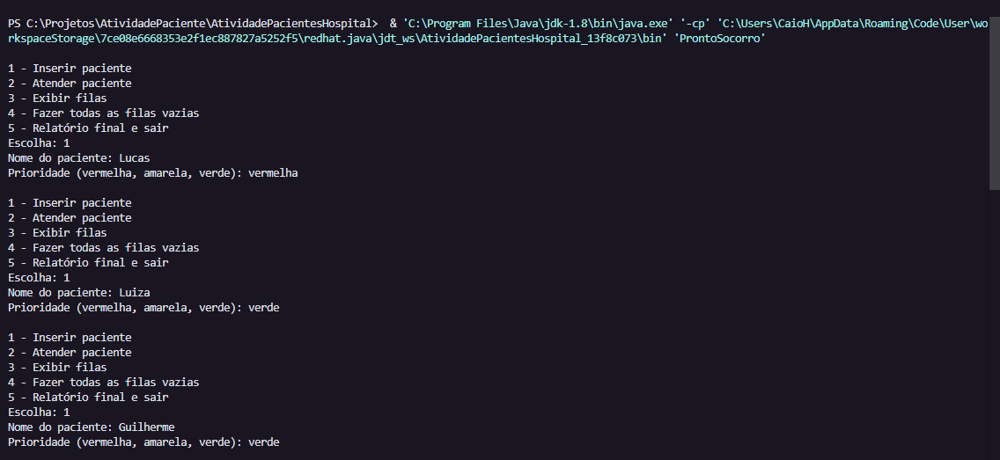
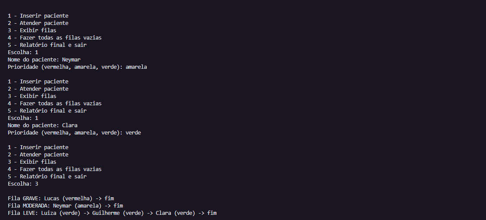

# 🏥 Sistema de Atendimento em Pronto-Socorro

## 📋 Descrição
Projeto desenvolvido para a disciplina de Algoritmos e Estruturas de Dados utilizando filas encadeadas para organizar pacientes por prioridade.

O sistema simula um ambiente de pronto-socorro, separando os atendimentos em três níveis de prioridade:
- 🔴 Grave
- 🟡 Moderada
- 🟢 Leve

A lógica implementada garante que pacientes mais graves sejam atendidos primeiro, respeitando a ordem de chegada dentro de cada fila.

---

## ✨ Funcionalidades
- Cadastro de pacientes
- Atendimento por prioridade
- Exibição das filas
- Relatório final

---

## 🛠️ Tecnologias Utilizadas
- Java
- Estruturas de Dados
- Programação Orientada a Objetos

---

## 🧠 Conceitos Aplicados
- Filas encadeadas
- Nós encadeados
- Generics
- Encapsulamento

---

## 🚀 Como Executar

1. Clone este repositório:
git clone https://github.com/ccaiomatos/sistema-atendimento-pronto-socorro.git
2. Abra na IDE
3. Execute a classe Main

## Autor
Caio Cordeiro Matos

## Demonstração

